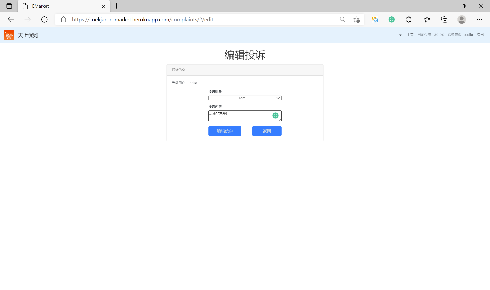

系统实现报告
===

## 实现环境

### 数据库系统与前后端框架

#### 本地开发

* 数据库：SQLite3（关系数据库）
* 前后端框架：Ruby On Rails - Rails 5.2.6
* 主要相关依赖版本：
  * Ruby - Ruby 2.7.4
  * Bootstrap - Bootstrap 4.0.0.alpha6

#### 远程部署

远程部署于 Heroku 平台，远端数据库为 PostGreSQL（对象 - 关系数据库）。

由于该远程服务器的文件系统是 [短寿](https://help.heroku.com/K1PPS2WM/why-are-my-file-uploads-missing-deleted) 的，因此上传的图片很可能在一段时间后失效。

### 本地构建

```shell
$ bundle install
```

### 本地运行

```shell
$ rails db:migrate && rails s
```

随后访问 `localhost:3000` 端口即可。

## 系统功能结构图


## 基本表、主外码、索引

### 基本表

#### 账户 Account

| PK账户ID | STR用户名 | STR密码 | ENUM身份 | DEC余额 |
|--------|--------|-------|--------|-------|

* 身份是一个枚举类型，只能是 `Admin`、`Seller`、`Customer` 之一。

#### 买家 Customer

| PK买家ID | FK账户ID |
|--------|--------|

#### 卖家 Seller

| PK卖家ID | FK账户ID |
|--------|--------|

#### 管理员 Admin

| PK管理员ID | FK账户ID |
|---------|--------|

#### 投诉记录 Complaint

| PK投诉记录ID | FK买家ID | FK卖家ID | STR投诉内容 |
|----------|--------|--------|---------|

| PK投诉记录ID | PK管理员ID |
|----------|---------|

#### 店铺 Shop

| PK店铺ID | STR店铺名 | STR简介名 | FK卖家ID |
|--------|--------|--------|--------|

#### 商品类别 Category

| PK商品类别ID | STR类别名 |
|----------|--------|

#### 商品 Commodity

| PK商品ID | STR商品名 | STR商品简介 | DEC单价 | FK店铺ID |
|--------|--------|---------|-------|--------|

| PK商品ID | PK商品类别ID |
|--------|----------|

#### 订单 Order

| PK订单ID | INT数量 | DEC总价 | BOOL是否已结算 | FK商品ID | FK买家ID |
|--------|-------|-------|-----------|--------|--------|

#### 购买记录 Record

| PK购买记录ID | FK订单ID | FK评论组ID |
|----------|--------|---------|

#### 评论组 Section

| PK评论组ID | ENUM评分 |
|---------|--------|

* 评分是一个枚举类型，只能是 `1 ~ 5` 闭区间内的整数。

#### 评论 Comment

| PK评论ID | STR内容 | FK父级评论ID | FK账户ID | FK评论组ID |
|--------|-------|----------|--------|---------|

### 主外码

在上述表格中：
1. 若有且仅有一列 $c$ 被标注为 PK，则此表的主码就是 $c$；
2. 若有多于一列 $c_1,c_2,\dotsm,c_n(n\ge 2)$ 被标注为 PK，则此表的主码就是 $(c_1,c_2,\dotsm,c_n)$。

被标注为 FK 的是外码。

### 索引

对于一般情况，由于程序逻辑中经常需要且只需要查询外码，因此设计为：某一列有索引，当且仅当该列被标注为 FK。

## 安全性设计、权限管理

### 数据库与控制程序隔离

Rails 框架将控制程序与数据库解耦，因此控制程序并不会直接产生并调用 SQL 语句来操作数据库，而是通过 [OR Mapping](#rails-模型映射数据库实体or-mapping) 来间接操作数据库。因此安全性有一定的保障——可以防御诸如 SQL 注入的攻击。

### 前端展示与后端验证

#### 前端按用户角色展示

Rails 框架为前端渲染提供了 Embedded RuBy 视图渲染文件。在这些文件中可使用来自控制器的实例变量，内嵌 Ruby 代码来生成 HTML 文件，随后将 HTML 文件发送给前端，为用户提供 GUI 接口。

以 /app/views/accounts/statistic.html.erb 文件（初版，未加入 CSS/JS 等）为例：

```erb
<!-- /accounts/id/statistic ->
<h1>Sales Volume Statistic</h1>

<% if current_seller? %>
  <% current_account.seller.shops.each do |shop| %>
    <h3><%= shop.name %></h3>
    <% shop.commodities.each do |commodity| %>
      <p><%= commodity.name %>: <%= commodity.sales_volume %></p>
    <% end %>
  <% end %>
<% elsif current_admin? %>
  <% Shop.all.each do |shop| %>
    <h3><%= shop.name %> - (<%= shop.seller.account.name %>)</h3>
    <% shop.commodities.each do |commodity| %>
      <p><%= commodity.name %>: <%= commodity.sales_volume %></p>
    <% end %>
  <% end %>
<% end %>
```

当面对合法的 `GET /accounts/id/statistic` 请求时，ERB 文件通过判断当前用户是卖家还是管理员，生成不同的 HTML 页面发送回前端。

#### 后端以 `before_action`、`require/permit` 等进行验证

由于用户可能会通过某些手法绕过前端 GUI，直接向后端发送 `GET/POST` 等请求，因此需要进行后端验证。

#### 防范非法 `GET` 请求

例如，某买家用户直接向后端发送 `GET /accounts/id/statistic` 请求。由于本系统仅允许管理员和卖家查看销量信息，因此买家用户的这个请求是不合法的。以 /app/controllers/accounts_controller.rb 为例，讲解后端验证的实现：

```ruby
class AccountsController < ApplicationController
  # ...

  before_action :authenticate_statistic, only: [:statistic]
  
  # ...

  def authenticate_statistic
    redirect_to root_url, alert: "Illegal Behavior!" unless
      current_admin? || current_seller?
  end

  def statistic
  end

  # ...
end
```

利用 Rails 提供的 `before_action` 函数，使得调用 `statistic` 之前先进行 `authenticate_statistic` 验证：只有当前用户为管理员或卖家时，才不会重定向回主页并显示“非法行为”。这样就能够保证买家无法访问销量统计页面。

#### 防范非法 `POST` 请求

例如，某买家用户通过某些手法直接向后端发送 `POST /customers/id/orders` 请求（创建订单），**表单中未指定 `customer_id` 字段**！以后端的 /app/controllers/orders_controller.rb 为例，讲解后端验证的实现：

```ruby
class OrdersController < ApplicationController
  # ...

  # POST /orders or /orders.json
  def create
    @order = Order.new(create_order_params)
    if @order.count <= 0
      redirect_to commodity_url(@order.commodity), alert: "Illegal Count"
    end
    @commodity = Commodity.find(params[:order][:commodity_id])
    @order.price = @commodity.price * params[:order][:count].to_i
    respond_to do |format|
      if @order.save
        format.html {
          redirect_to customer_orders_url(@order.customer),
          notice: "成功创建订单！"
        }
        format.json {
          render :show,
          status: :created,
          location: @order
        }
      else
        format.html {
          render seller_shop_url(@commodity.shop.seller, @commodity.shop),
          status: :unprocessable_entity
        }
        format.json {
          render json: @order.errors,
          status: :unprocessable_entity
        }
      end
    end
  end

  # ...

  private
    
    # ...

    def create_order_params
      params.require(:order)
        .permit(:count, :done, :commodity_id, :customer_id)
    end

    # ...
end
```

其中需关注 `create_order_params` 函数，该函数对前端发来的表单进行字段级验证——检验是否确实发来了所需的字段。该函数中 `require & permit` 要求一定要有 `customer_id` 字段，从而防御了前述非法请求。

再比如，某买家用户通过某些手法直接向后端发送 `POST /customers/id/orders` 请求（创建订单），**表单中指定的商品数量为负数**！上面代码中，`create` 函数中就针对这种情况进行了检测。

## 存储过程、触发器、函数

### 存储与更新

当需要向数据库中插入新的数据或更新数据时，将使用 Rails 的 ORM 提供的各种方法。如：新建一个账户并将其插入到数据库时，使用 `Account` 对象的 `save` 方法：

```ruby
@account = Account.new
@account.name = # ...
@account.password = # ...
@account.role = # ...
@account.save # if success
```

有 OR Mapping 转换如下：

```sql
INSERT
INTO accounts (name, password, role)
VALUES (@account.name, @account.password, @account.role)
```

当要更新数据时，也由 Rails 提供 ORM 提供的各种方法。如：更新一个账户的余额，使用 `Account` 对象的 `update_attribute` 方法：

```ruby
@account.update_attribute(:balance, 0)
```

有 OR Mapping 转换如下：

```sql
UPDATE accounts SET balance = 0 WHERE accounts.id = @account.id
```

### 触发器 - 依赖递归删除

当删除一个数据库对象时，将链式地删除他所拥有的资源。如：删除一个卖家时，会删除他的商铺，商铺中的商品等。此实现由 Rails 的 Dependent-Destroy 支持：

```ruby
# /app/models/seller.rb
class Seller < ApplicationRecord
  # ...
  has_many :shops, dependent: :destroy
end

# /app/models/shop.rb
class Shop < ApplicationRecord
  belongs_to :seller
  has_many :commodities, dependent: :destroy
  # ...
end
```

当欲删除一个 `Seller` 时，首先删除他的所有 `Shop`；欲删除 `Shop`，则首先删除该 `Shop` 的所有 `Commodity`。因此有 OR Mapping 将 `@seller.destroy` 转换如下：

```sql
DELETE FROM commodities WHERE commodities.shop_id IN (
    SELECT shops.id FROM WHERE shops.seller_id = @seller.id
)
DELETE FROM shops WHERE shops.seller_id = @seller.id
DELETE FROM sellers WHERE sellers.id = @seller.id
```

## 实现过程的主要技术、主要模块

### Rails 模型映射数据库实体（OR Mapping）

Rails 提供了 Model 映射数据库实体，例如本项目中 `Seller` 模型（/app/models/seller.rb）就映射了数据库的表格 `sellers`。对于一个 `Seller` 模型的实例 `@seller`，若使用其方法 `@seller.shops`，即对应到 SQL 操作：

```sql
SELECT shops.* FROM shops WHERE shops.seller_id = @seller.id
```

这样，就可以直接操作 Rails Model 对象，间接影响数据库。

### 路由 - 控制器 - 渲染

前端发送请求后，路由接收到前端的请求，随后根据 /config/routes.rb 中定义的路由信息，找到对应的控制器（Controller）与动作（Action）。本项目的路由信息可由如下命令给出：

```shell
$ rake routes
      Prefix Verb   URI Pattern                  Controller#Action
         ... ...    ...                          ...
    accounts GET    /accounts(.:format)          accounts#index
             POST   /accounts(.:format)          accounts#create
 new_account GET    /accounts/new(.:format)      accounts#new
edit_account GET    /accounts/:id/edit(.:format) accounts#edit
     account GET    /accounts/:id(.:format)      accounts#show
         ... ...    ...                          ...
```

随后落入当前请求对应的控制器动作中，由控制器来进行 ORM 操作，并制作前端视图（View）并发回前端。此处，前端视图 HTML 由内嵌 Ruby 代码的 ERB 文件制作。

### 主要技术——函数式程序操作数据

以按类别筛选商品为例，讲述函数式操作数据的实例：

```ruby
class Commodity < ApplicationRecord
  # ...
  scope :filter_by_categories, -> (cset) {
    reject { |c|
      (c.category_ids.map(&:to_i) & cset.reject(&:blank?).map(&:to_i)).empty?
    }
  }
  # ...
end
```

此处定义了一个类方法（Class Method）`filter_by_categories`，该方法接受一个商品类别列表 `cset`，此方法将当前商品列表中满足 `reject` 条件的商品剔除。其中 `reject` 条件为商品所持有的类别（**商品与商品类别是多对多关系**）与 `cset` 交集为空。

### 主要模块—— MVC 模式


## 系统功能的运行实例

## 测试用例设计

我们将按照以下的步骤进行系统功能的演示：

- 首先，进入登录页面，登录已经存在的管理员账号，演示  `admin` 的功能：

  

- 进入主页，我们首先来管理一下商品的类别，点击“所有分类”，跳转到商品所有类别的页面：

  

- 目前商城中没有已有的分类，所以为空：

  

- 我们点击“新建分类”，可以跳转到新建类别界面，我们新建一个“蔬菜”类别，并填写相应信息：

  

- 点击更新类别信息，我们可以跳转到“蔬菜”类别的商品列表，目前没有蔬菜，所以商品为空：

  

- 接下来，为了展示效果，我们重复以上步骤，再新建几个类别，最终得到的效果图如下：

  

- 初始准备完毕，下面我们点击“登出”，换一个身份登录：

- 我们注册一个  `seller` 角色的账号，设置其账号与密码：

  

- 点击注册，返回到登录界面，得到自己的 ID 信息，接下来利用 ID 和密码进行登录

  

- 现在进入到商城主页，目前数据库中没有商品的数据，所以没显示出商品

  

- 点击“我的商店”按钮，进入到该账号开设的商店列表，接着我们新建一个商店，填写的信息如下图所示：

  

- 点击创建商店，我们可以看到该页面的“我的商店”部分多出了一行，这就是我们刚刚创建的商店：

  

- 点击“查看详情”即可查看本商店的信息进入到商店的信息页面，点击上方的“编辑”按钮，可以编辑商店的基本信息：

  

- 在编辑页面，我们把店名和介绍做一定的修改，点击编辑商店即可保存编辑：

  

- 重新点击“查看详情”，可以看到信息已经得到了修改：

  

- 接下来，我们在下方新建一个商品“火龙果”，提供商品名称、介绍、价格和图片等信息，点击新增商品完成创建：

  

- 现在我们完成了创建商品，跳转到了该商品的展示页面，该页面展示了商品的基本信息：

  

- 点击编辑，我们调整一下该商品的价格：

  

- 返回到该商品的展示页面，可以看到已经完成了修改：

  

- 重复以上步骤，我们创建多个商品和店铺，供后续演示使用，全部创建好之后如图所示：

  

- 我们利用筛选功能做一个筛选，筛选出该卖家所有的“蔬菜”和“电子产品”，如图所示：

  

- 登出账号，然后注册一个 `customer` 账号，并充值 100 元：

  

- 接下来我们查看一下“苹果”：

  

- 我们将2个苹果加入购物车，跳转到了购物车界面，这里展示的是所有已经下单但还没有支付的订单：

  

- 我们点击“查看订单”，并点击“现在支付”直接进行支付，得到“订单完成”的提示，并注意到了右上角余额的变化：

  

- 右上角导航栏查看购物记录，可以看到所有**已经完成支付**的订单，我们之前已经购买过其他东西，所以上面有几条购买记录：

  

- 我们查看刚刚完成的订单，对其进行评分（1-5分），并创建评论：

  

- 我们可以尝试对评论进行回复，如图所示：

  

- 回到商品页面，可以看到对该商品的所有回复：

  

- 假设我们认为商品有问题，想要投诉商家，则可以点击导航栏下拉菜单中的“我的诉求”按钮，新建一个诉求：

  

- 在新建的诉求中选择自己要投诉的商家以及投诉理由，点击“创建诉求”，则生成了一个新的诉求：

  

- 我们可以尝试修改诉求的理由，点击”修改信息“，则可以将修改保存：

  

- 切换回刚才的 `seller` ，点击导航栏下拉菜单中的”统计“按钮，可以得到该卖家所有的商品的销售数据统计情况

  

- 点击导航栏下拉菜单中的”所有投诉“按钮，可以得知当前该卖家收到了多少次投诉，但该卖家只能查看投诉详情，不能编辑和处理以及删除投诉：

  

- 切换回 `admin` 账号，点击导航栏下拉菜单中的”统计“按钮，可以得到该卖家所有的商品的销售数据统计情况：

  

- 点击导航栏下拉菜单中的”所有投诉“按钮，可以得知当前一共有多少个投诉，以及每个投诉的处理状态：

  

- 对于未处理的投诉，可以选择删除或者处理。在这里我们直接处理刚才发出的投诉：

  

- 处理之后，对于该投诉，只能查看内容，不能进一步编辑：

  

## 源程序简要说明

### 路由

路由 /config/routes.rb 如下：

```ruby
Rails.application.routes.draw do
  resources :complaints do
    get 'handle'
    post 'do_handle'
  end
  root :to => 'commodities#index'

  resources :sellers do
    resources :shops
  end

  resources :commodities do
    resources :sections do
      resources :comments do
        get 'reply'
        post 'do_reply'
      end
    end
    collection do
      post 'do_filter'
    end
  end

  resources :categories
  resources :admins
  resources :customers do
    resources :orders do
      post 'purchase'
    end
    resources :records
  end
  resources :accounts do
    collection do
      get 'login'
      post 'do_login'
      get 'logout'
      get 'register'
      post 'do_register'
    end
    get 'top_up'
    post 'do_top_up'
    get 'statistic'
  end
end
```

此处定义了若干 `resources` 资源，这意味着一般情况下他们都可以进行增删改查。若 B 资源嵌套在 A 资源中，则意味着 B 依赖于 A 而存在。

也定义了若干 `get/post` 资源，这些资源直接指定对应的链接与控制器方法。

注意，若某方法嵌套在 `collection do .. end` 中，则意味着这是一个集合方法，而不是针对某一个资源的方法。如 `account` 的 `login` 方法，它并不需要知道账户——不需要提供账户，也能显示登录页面。所以这些集合方法在 `rake routes` 中显示如下：

```shell
login_accounts GET  /accounts/login(.:format)    accounts#login
```

`accounts` 与 `login` 之间没有 `:id`。

### 控制

每一个实体的控制器均位于 /app/controllers/ 下，每一个控制器均内置多个与路由对接的方法。如路由信息所示：

```shell
      Prefix Verb   URI Pattern                  Controller#Action
         ... ...    ...                          ...
    accounts GET    /accounts(.:format)          accounts#index
             POST   /accounts(.:format)          accounts#create
 new_account GET    /accounts/new(.:format)      accounts#new
edit_account GET    /accounts/:id/edit(.:format) accounts#edit
     account GET    /accounts/:id(.:format)      accounts#show
         ... ...    ...                          ...
```

例如：`GET /accounts` 请求将触发 `accounts_controller.rb` 中定义的 `index` 方法。

控制器方法要么处理 `GET` 请求（如：`index` 按约定渲染 index.html.erb），要么根据表单处理 `POST` 请求（如：`accounts#create` 按表单处理 `POST /accounts` 请求）。

### 渲染

控制器处理 `GET` 请求时，使用 Ruby 代码渲染 views 中的前端 HTML（ERB 文件引导渲染），并将 HTML 页面反馈给前端。

## 收获与体会

### 组员的收获与体会

@陈纪源： 通过完成数据库大作业，我了解了一个数据库系统的构思到最终的完成的整个设计过程。从最开始的设计需求分析、到后面的概念结构设计、逻辑结构设计、物理结构设计、到后面的数据库编码实施最后到数据库的运行和维护，整个过程都体会过后明白了每一阶段的重要性。在概念结构设计时，粗心马虎缺少一两个实体，在编码时再新增实体可能就会导致整个系统无法使用，这也就提醒我们设计时思维要完备。在数据库编码过程中，体会到MVC模式的重要意义，这是一种安全的操作数据库方式且可以获得筛选过的数据。最后学习了如何对前端网页进行渲染，可以说一个好的网页需要自己不断进行打磨。看到一个完整的电商平台，整个人的成就感还是非常高的！

@战晨曦：通过做这次数据库项目，我收获很多。首先，我作为队伍中负责前端的人员之一，这是我第一次编写应用软件的前端，深刻体会到了做好前端开发十分不容易，需要非常多耐心和经验；其次，在项目开发的过程中我深刻体会到了搜索引擎与搜索技巧的重要性，因为一个不熟练的开发人员肯定会时常去查 API 文档以及 de 奇奇怪怪的 bug，这个时候使用 google 进行搜索，效率能够远远胜过 bing 和 baidu，倘若因为网络问题无法使用 google，则需要采用一定的搜索技巧，比如纯英语搜索，手动加 stackoverflow 等限定关键字，从而获得更加有针对性的信息；第三点，在实现项目的过程中我初步理解了前端和后端的交互方式，并深刻体会到了前后端耦合的危害；第四，在进行测试时，我体会到了系统的安全验证需要前后端共同配合来实现，单靠前端或者后端都可能没法有效避免用户的非法操作。总的来说，本次开发路途是曲折的，但前途是光明的。

### 组长的收获与体会

@叶焯仁：积极意义上看，本次开发充分体现了分工合作与各司其职的重要性，前端后端分工明确，责任到人，生产出高可维护的代码，及时修正漏洞。最重要的是，通过本次开发，我们完成了一个数据库系统的应用，基本了解了前端后端的概念。应用 Ruby On Rails 为我们提供的丰富接口，我们初步了解了 MVC 开发模式，并最终形成具有一定规模的应用。消极意义上看，本次开发也暴露出了我们在各种技术上的不纯熟，以及沟通上的欠缺，这也引发了我对领导团队开发的一些思考。综合来说，在时间如此紧张的情况下，我们仍然能够做出这个系统，实在是收获颇丰！
